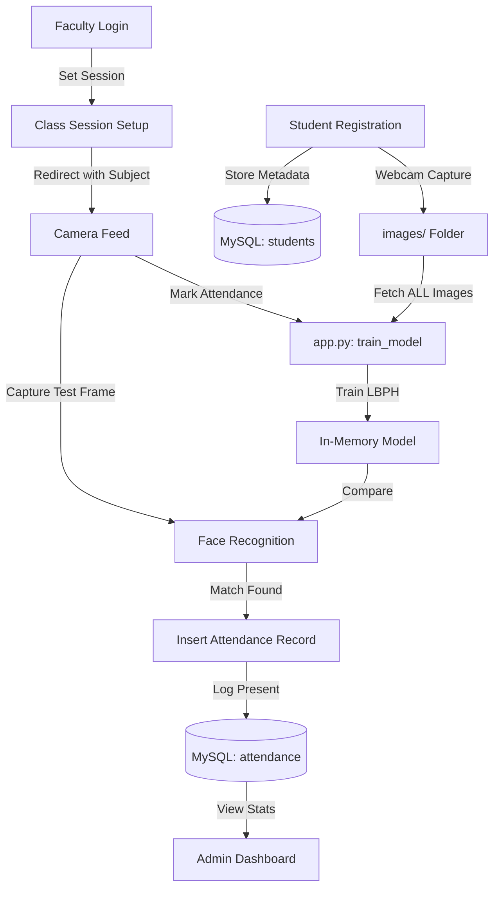

# Technical Audit: Smart Attendance System

I have conducted a comprehensive technical audit of the Smart Attendance System codebase. Below is the detailed breakdown of the project structure, logic, security analysis, and data flow.

---

### 1. Project File Index
| File | Description |
| :--- | :--- |
| **app.py** | The core Flask application handling routing, logic, and the face recognition engine. |
| **db.py** | Database connection utility (contains an inconsistency with `app.py`). |
| **face_utils.py** | Utility script using `DeepFace` (Note: Currently unused in the main `app.py` flow). |
| **train.py** | Standalone script for training the LBPH model and saving it to `trainer.yml`. |
| **haarcascade_frontalface_default.xml** | Pre-trained Haar Cascade model used for face detection within images. |
| **index.html** | Main landing page/dashboard with navigation to all system features. |
| **login.html** | Multi-role (Admin, Faculty, Student) authentication portal. |
| **register.html** | Student registration page with form fields for metadata and face capture. |
| **attendance.html** | Table view for browsing and deleting attendance records. |
| **camera.html** | Live camera interface for marking attendance using face recognition. |
| **dashboard.html** | Analytics page showing attendance stats by department and subject. |
| **class_session.html** | Session setup page for professors to define current subject/time before scanning. |
| **style.css / script.js** | Global assets for UI styling and general client-side interactions. |
| **test_*.py** | Various testing scripts for camera, OpenCV, and Haar Cascades. |
| **dlib...whl** | Binary wheels for `dlib` installation (likely for environment setup). |

---

### 2. app.py — The Engine Room
`app.py` is the central controller of the system.

- **Flask Structure**: It follows a flat structure where all routes and logic reside in one file.
- **Role-Based Logic**:
    - **Admin/Faculty**: Managed via `session['role']`. Can view all records and registration.
    - **Student**: Redirected to a specific `student_dashboard` via `session['reg_no']` to see personal history.
- **Key Logic Flow**:
    1. **Registration**: Validates input → Opens local webcam → Captures 20 frames → Saves to `images/` → Stores metadata in MySQL.
    2. **Recognition**: Triggered by `/mark_attendance`. It calls `train_model()`, captures a frame, detects faces, predicts identity using LBPH, and logs "Present" in the DB.
- **The Bottleneck**: It re-trains the entire model (`train_model()`) **every time** someone marks attendance. As the student count grows, this will become exponentially slow.

---

### 3. Database Schema (`db.py` & MySQL)
The system uses MySQL. While no `.sql` file is present, the schema is inferred from queries in `app.py`:

| Table | Columns |
| :--- | :--- |
| **students** | `id` (PK, AI), `name`, `reg_no`, `department`, `class`, `password`, `email`, `phone` |
| **attendance** | `id` (PK, AI), `student_id` (FK), `name`, `department`, `class`, `subject`, `date`, `time`, `status` |
| **admins** | `id`, `username`, `password` |
| **faculty** | `id`, `faculty_id`, `password`, `name` |

**Important Note**: `db.py` and `app.py` have conflicting passwords (`root123` vs `root1909`). `app.py` has its own hardcoded `connect_db` function, making `db.py` redundant.

---

### 4. Face Recognition Logic
- **`face_utils.py`**: Contains a function `verify_face` using **DeepFace** (a high-level DL library). However, this file is **not imported** or used by the Flask app.
- **Active Method**: `app.py` uses **OpenCV's LBPH (Local Binary Patterns Histograms)**. This is a traditional machine learning approach that is fast but less accurate than modern Deep Learning (CNNs), especially in varying lighting.

---

### 5. Training Process (`train.py`)
- **Storage**: Face data is stored as raw `.jpg` files in the `images/` directory.
- **Workflow**:
    1. Reads all files in `images/`.
    2. Extracts the `reg_no` from the filename (e.g., `22CS001_1.jpg`).
    3. Converts to grayscale and detects faces.
    4. Trains the LBPH recognizer.
- **Efficiency**: `train.py` saves a `trainer.yml` file, but `app.py` **never loads it**. It re-trains from scratch on every attendance request to ensure the latest data is used—this is highly inefficient.

---

### 6. HTML Components & Backend Connectivity
The UI is a "Premium" styled interface using Grid/Flexbox layouts and CSS animations.

| Page | Frontend Logic | Backend Route |
| :--- | :--- | :--- |
| **index.html** | Navigation hub with icon-based menu. | `/` |
| **login.html** | Role-switching tabs (Admin/Faculty/Student). | `/login` |
| **register.html** | Multi-step form with live preview ID card. | `/register` |
| **camera.html** | Handles webcam streaming using MJPEG. | `/camera` |
| **attendance.html** | Jinja2 loops to render DB records. | `/attendance` |
| **dashboard.html** | Visual bar charts for stats. | `/dashboard` |

---

### 7. Technical Audit: Issues & Risks

#### 🔴 Security Issues
1. **Plaintext Passwords**: No hashing (bcrypt/argon2) is used for student, faculty, or admin passwords.
2. **SQL Injection Risks**: While many queries are parameterized, the overall security posture is weak for user inputs.
3. **Hardware Access Error**: The backend tries to open the webcam on the **server hardware** (`cv2.VideoCapture(0)`). This works on a personal laptop but will fail if you deploy it to a remote server (the server has no camera).

#### 🟡 Architecture Weaknesses
1. **Retraining Loop**: `app.py` calls `train_model()` on every recognition event. This creates a massive lag as the dataset grows.
2. **Thread Blocking**: OpenCV operations are synchronous. One user's facial scan blocks the entire Flask application for other users.
3. **Inconsistent DB Config**: Credential mismatch between `db.py` and `app.py`.

---

### 8. Complete Data Flow

---

### 9. Library Dependencies
| Library | Purpose |
| :--- | :--- |
| **flask** | Core web framework. |
| **opencv-python** | Face detection (Haar Cascades) and Recognition (LBPH). |
| **mysql-connector-python** | Interface for the smart_attendance database. |
| **numpy** | Efficient handling of image matrices. |
| **DeepFace** | (Installed but unused) Present in face_utils.py. |
| **datetime** | Generating timestamps for logs. |
